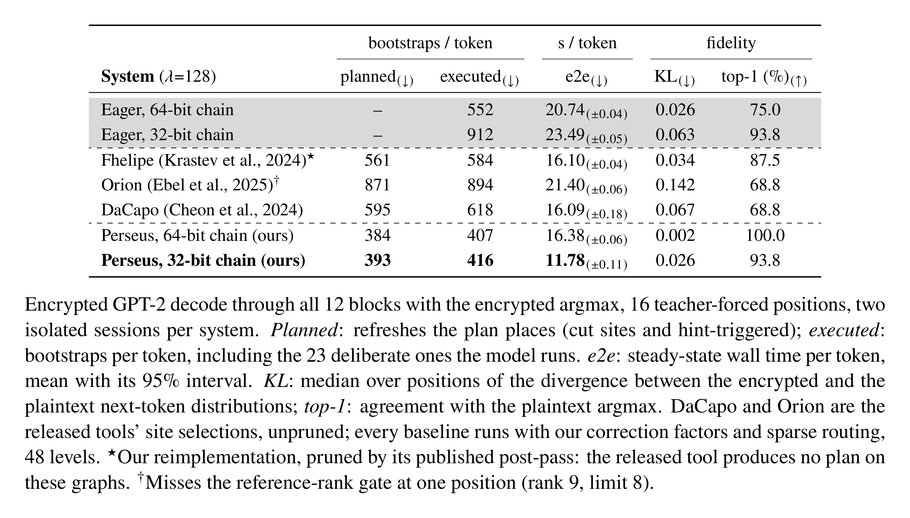

<p align="center">
  <a href="https://www.uniroma1.it/en"></a>
  &nbsp;&nbsp;&nbsp;&nbsp;&nbsp;&nbsp;&nbsp;&nbsp;&nbsp;&nbsp;
  <a href="https://gladia.di.uniroma1.it">
    <picture>
      <source media="(prefers-color-scheme: dark)" srcset="assets/gladia-logo-white.svg">
      <source media="(prefers-color-scheme: light)" srcset="assets/gladia-logo.svg">
      
    </picture>
  </a>
</p>

<h1 align="center">Perseus: A Bootstrap Placer for Faster Encrypted Transformer Inference</h1>

<p align="center">
  <a href="https://github.com/gladia-research-group/FIDESlib32bits">FIDESlib32bits runtime</a> ·
  <a href="#0-install">Quickstart</a> ·
  <a href="#citation">Citation</a> ·
  <a href="LICENSE">BUSL-1.1 license</a>
</p>

Fully homomorphic encryption lets a server run a language model on encrypted inputs, but under
CKKS every multiplication consumes a level of the modulus chain, and a ciphertext that runs out
of levels must be bootstrapped, an operation that dominates encrypted inference. Where the
bootstraps go, and what kind, therefore decides most of the latency, yet existing placers choose
sites from multiplicative depth alone and cannot see what a transformer's nonlinearities do to
the values they refresh.

**Perseus** decides **where** and **how** to bootstrap from a single profiling pass of the model:
every ciphertext edge is recorded with its packing period and the largest coefficient of its
polynomial, and an iterated minimum cut places the refreshes, each typed with the correction
factor its data admits and, where the packing is periodic, with a cheaper sparse bootstrap. On
encrypted GPT-2 decoding it executes 416 bootstraps per token against 584–894 for prior
placers, and decodes at 11.78 s/token against 16.09–21.40 s/token.

This repository contains the planner, the encrypted GPT-2 model written on the runtime's
primitives (`perseus.impl`, `examples/gpt2_from_primitives`), the captured graphs and every
bootstrap plan behind the results, and the drivers that regenerate the baselines from the
released DaCapo and Orion tools. The runtime is a 32-bit composite-scaling port of
[FIDESlib](https://github.com/CAPS-UMU/FIDESlib)
([FIDESlib32bits](https://github.com/gladia-research-group/FIDESlib32bits)), vendored as a
submodule, that regenerates the random half of every key-switching key in-kernel and bit-packs
the rest.

## Results

Encrypted GPT-2 decoding on one NVIDIA RTX PRO 6000 Blackwell, logN = 16, 128-bit security.

<p align="center">
  <a href="assets/results-table-light.png">
    <picture>
      <source media="(prefers-color-scheme: dark)" srcset="assets/results-table-dark.png">
      <source media="(prefers-color-scheme: light)" srcset="assets/results-table-light.png">
      
    </picture>
  </a>
</p>

The 32-bit chain has 27 composite levels over 54 primes (pairs of 27-bit primes per level, q0 a
pair of 28-bit primes); the 64-bit reference chain has 28 levels of 53-bit primes. Key-switching
keys on the 32-bit row:

| configuration | s/token | used VRAM |
|---|---|---|
| in-kernel `a` regeneration + `b` packing (shipping) | 11.86 | 32.55 GiB |
| regeneration only (`FIDESLIB_KSK_PACK=0`) | 12.19 (+3%) | 34.49 GiB |
| packing only (`FIDESLIB_KSK_REGEN=0`) | 14.18 (+20%) | 41.61 GiB |

[`bootstrap_placements/README.md`](bootstrap_placements/README.md) maps every plan directory
(the dense-only rows and the correction-factor and margin ablations included) to its recipe.

## Layout

- `perseus/`
  - `impl/` the model layer on the runtime's primitives: kernels, masks, the residency ring and
    the capture / planned execution modes.
  - `plan/` the planner: the captured-graph IR, the level simulator, the min-cut placer, the
    refresh typing (correction factor, sparse route) and the ports of the baseline placers.
  - `nn/`, `calibrate/`, `export.py` the module API, the approximation calibration and the
    HuggingFace export.
- `examples/gpt2_from_primitives/` encrypted GPT-2 decode and generation on `perseus.impl`,
  with its plan script `make_plan.sh`.
- `graphs/gpt2_decode_python_{n32,n64}/` the captured graphs the plans are computed from.
- `bootstrap_placements/` one directory per plan, each with its `PLAN_CMD.txt` recipe.
- `configs/model/approximation/` the calibrated approximation configs (`gpt2_base_n32` 32-bit,
  `gpt2_base` 64-bit).
- `scripts/` build, run and plan scripts; `scripts/utils/{dacapo,orion}_upstream/` drive the
  released baseline tools.
- `src/`, `include/` the CUDA runtime and its pybind11 layer (`perseus._core`, `perseus._client`).
- `third_party/` the FIDESlib32bits submodule and the OpenFHE patch series.
- `assets/` the logos and the results table (`results-table.tex`, rendered by `render.sh`).

## Python API

Two layers share one session. `perseus.impl` is the one the results run on: an encrypted model
written in Python on the runtime's leaf primitives, with graph capture and planned execution
built in. `examples/gpt2_from_primitives` is GPT-2 written on it. From the repository root,
after the install below and `source scripts/local_env.sh`, which sets `WEIGHTS_PATH` and the
oracle the embedded tokens are read from:

```python
import os
from examples.gpt2_from_primitives import env, weights
from examples.gpt2_from_primitives.model import Gpt2Primitives

PACKING = "cachemir_complex"                    # the packing the shipped plans were cut under
sess = env.open_session(device=0, chain="n32", GPT2_PACKING=PACKING)   # decode env + keygen
from perseus import _core                       # after the session has exported its env
from perseus.impl import config

model = Gpt2Primitives(sess.inf, weights.RawStore(os.environ["WEIGHTS_PATH"]),
                       config.load_configs("configs/model/approximation/gpt2_base_n32/configs.json"),
                       core=_core, packing=PACKING)
model.load_plans("bootstrap_placements/gpt2_decode_python_n32")      # without it: eager
cfg = _core.RunConfig.from_env(); cfg.tokens = 4
out = model.run_decode(_core.read_teacher_forced_inputs(cfg), argmax=True)   # one record per token
print([(r["top1"], r["cutmax"]) for r in out])  # argmax of the decrypted logits, encrypted argmax
model.close(); sess.close()
```

`model.set_capture(dir)` in place of `load_plans` records the graph the planner reads (step 2
below). A new model is an `ImplModel` subclass that names its stages, its per-step masks and its
weights; `perseus/impl/__init__.py` lists the modules, and `docs/PYTHON_API.md` writes an op
from the primitives.

`perseus.nn` is the module API: modules over the runtime's C++ composites, whose
approximations are calibrated on your data:

```python
import numpy as np
from perseus import session
from perseus.profile import SessionProfile
from perseus.nn import EncGELU, EncLinear, EncSequential, calibrate_sequential

d, e, real = 1024, 4096, 768                       # packed widths; 768 real features
rng = np.random.default_rng(0)
W1 = rng.standard_normal((d, e)) * 0.5 / np.sqrt(real); W1[real:, :] = 0; W1[:, 3072:] = 0
W2 = rng.standard_normal((e, d)) * 0.5 / np.sqrt(3072); W2[3072:, :] = 0; W2[:, real:] = 0

with session(profile=SessionProfile.custom_n32()) as s:     # keygen + GPU context
    model = EncSequential(EncLinear("fc1", d, e, weight=W1), EncGELU("act"),
                          EncLinear("fc2", e, d, weight=W2)).bind(s)
    calibrate_sequential(model, rng.standard_normal((32, real)) * 0.3)   # fit GELU on your data
    x = rng.standard_normal(real) * 0.3
    y = s.decrypt(model(s.encrypt(x)), d=real)               # encrypted forward
```

`EncClient` / `EncServer` split the roles across a trust boundary (`docs/SECURITY_MODEL.md`);
`docs/PYTHON_API.md` is the reference. The notebooks (`NB=<name> bash scripts/run_notebooks.sh`
runs one headless) cover the artifacts, generation, a custom encrypted model and the
client-server protocol.

## Pipeline

One full pass for GPT-2 on the 32-bit chain, with the 64-bit differences. Every artifact a
step produces ships in the checkout, so any step can be skipped.

### 0. Install

Linux, CUDA 12.6 or newer, a GPU with 48 GB or more (the 32-bit decode peaks at about 33 GiB, the
64-bit one at about 46 GiB),
Python 3.11+, CMake 3.24+, gcc 12+, `libarchive-dev`, and NCCL (`libnccl2` + `libnccl-dev`, or
`NCCL_HOME` pointing at a prefix with `lib/libnccl.so` and `include/nccl.h`).

```bash
git clone --recurse-submodules https://github.com/gladia-research-group/perseus
cd perseus
uv sync                                  # or: python -m venv .venv && .venv/bin/pip install -e ".[hf,dev]"
```

That is the pure-Python half: export, calibration and the planner. The encrypted run needs the
CUDA extension:

```bash
NATIVE_SIZE=32 bash scripts/install_deps.sh      # patched OpenFHE + FIDESlib32bits -> deps_n32/
CHAIN=n32 bash scripts/local_build_core.sh       # perseus/_core.n32.so
.venv/bin/python -c "import perseus.nn"          # says exactly what is missing otherwise
```

`NATIVE_SIZE=64` / `CHAIN=n64` build the 64-bit chain next to it (`deps_n64/`, `_core.n64.so`);
the import name is a symlink to the active chain. `scripts/local_env.sh` holds every default and
an exported variable always wins:

| variable | used for | default |
|---|---|---|
| `CHAIN` | `n32` (32-bit composite chain) or `n64` | `n32` |
| `PERSEUS_DATA` | root of the weights, the calibration pool and the oracle | `.cache/` |
| `WEIGHTS_PATH` | the exported weights (`weights.bin.zip`) | under `PERSEUS_DATA` |
| `CONFIGS_PATH` | the calibrated approximation config | unset: the drivers take `gpt2_base_n32` (`gpt2_base` on n64) |
| `ALL_BLOCKS_IO_DIR` | the teacher-forced decode oracle | under `PERSEUS_DATA` |

On a machine without root, the prefix `NCCL_HOME` points at must hold **both**
`lib/libnccl.so` (to link) and `lib/libnccl.so.2` (to load), with `$NCCL_HOME/lib` on
`LD_LIBRARY_PATH`; the `nvidia-nccl-cu12` wheel ships only the second name, so symlink both from
`.venv/lib/python3.11/site-packages/nvidia/nccl/lib/`. `apt-get download libarchive-dev &&
dpkg-deb -x libarchive-dev_*.deb prefix` unpacks LibArchive's headers without installing
anything (pass `LibArchive_INCLUDE_DIR` and `LibArchive_LIBRARY`).

### 1. Export, calibrate and build the oracle

```bash
.venv/bin/perseus-export --model openai-community/gpt2 --out .cache/models/openai-community/gpt2
.venv/bin/python -c 'import numpy as np; from omegaconf import OmegaConf; from perseus.calibrate import data; \
    np.save(".cache/pools/openwebtext_gpt2.npy", np.asarray(data.load_token_pool("openai-community/gpt2", \
    OmegaConf.load("perseus/configs/dataset/openwebtext.yaml"))))'
.venv/bin/perseus-calibrate model=gpt2 dataset=openwebtext
.venv/bin/python scripts/utils/gen_gpt2_oracle.py --model openai-community/gpt2 \
    --pool .cache/pools/openwebtext_gpt2.npy --out .cache/oracle/gpt2/all_blocks_io
```

The export writes the packed weights, the calibration fits the approximation of every
nonlinearity (the shipped `gpt2_base_n32/configs.json` is the one the results use), and the
oracle holds the plaintext logits the decode gate compares against.
`notebooks/setup_artifacts.ipynb` walks through the same steps and skips any that exist.

An HE-aware-trained checkpoint, such as the HEAT GPT-2, is exported onto its base model with
`--checkpoint` (a `model.pt` or a hub repo id):

```bash
.venv/bin/perseus-export --model openai-community/gpt2 \
    --checkpoint gladia/heat-gpt2-small-openwebtext --tag heat --out .cache/models/gladia/heat-gpt2
.venv/bin/python scripts/utils/gen_gpt2_oracle.py --model openai-community/gpt2 \
    --checkpoint gladia/heat-gpt2-small-openwebtext \
    --pool .cache/pools/openwebtext_gpt2.npy --out .cache/oracle/gpt2_heat/all_blocks_io
```

### 2. Capture

The planner works on a record of one forward: every ciphertext edge with its packing period and
largest coefficient. The first token runs eagerly and is written block by block, the encrypted
argmax included:

```bash
source scripts/local_env.sh
.venv/bin/python -m examples.gpt2_from_primitives.run_decode --tokens 1 --argmax \
    --capture graphs/gpt2_decode_python_n32
```

A capture is bound to the runtime build and to the approximation config: change either and
re-capture.

### 3. Plan

Pure Python, seconds on the CPU. Each plan directory's `PLAN_CMD.txt` holds its recipe, and
`make_plans.sh` replays them:

```bash
bash scripts/make_plans.sh gpt2_decode_python_n32     # the 32-bit plan: blocks, then the argmax stage
bash scripts/make_plans.sh                            # every shipped plan
```

`python -m perseus.plan --help` lists the planner options (`--mag-safety` κ, `--err-target` τ,
`--cf-max`, `--sparse-slots`, `--prune`, `--placer {min_cut,orion,dacapo,fhelipe}`). Sites are
priced with the measured accuracy table `perseus/plan/data/bts_accuracy_n32.json`; the 64-bit
plans use the analytic error model.

The baselines come from the released tools. DaCapo needs `hecate-opt`, built once (LLVM/MLIR 18);
Orion's solver is cloned and patched on first use:

```bash
bash scripts/utils/dacapo_upstream/build_hecate.sh
bash scripts/make_plans.sh python/dacapo python/orion python/fhelipe
```

### 4. Run encrypted

```bash
source scripts/local_env.sh
DECODE=".venv/bin/python -m examples.gpt2_from_primitives.run_decode --tokens 16 --argmax"
$DECODE --plan bootstrap_placements/gpt2_decode_python_n32     # the 32-bit row: 416 bootstraps/token
$DECODE --plan bootstrap_placements/python/dacapo              # a baseline (python/orion, python/fhelipe)
$DECODE                                                        # eager: refreshes reactively, no plan
$DECODE --plan bootstrap_placements/gpt2_decode_python_n32_dense --set SPARSE_AUTO=0 --set SPARSE_BTS_SLOTS=0
```

The 64-bit row runs with `CHAIN=n64` exported before `source scripts/local_env.sh`, the import
symlink pointed at `_core.n64.so`, and `--chain n64 --plan bootstrap_placements/gpt2_decode_python_n64`.
`FIDESLIB_KSK_REGEN=0` or `FIDESLIB_KSK_PACK=0` give the key-switching rows.

A run passes when it prints `[decode] PASS`: the reference token stays near the top of the
encrypted distribution (`ref_rank`, gated by `GATE_REF_RANK_MAX`) and the divergence stays far
below the value a broken chain saturates at (`GATE_KL_MAX`; a detonated run reads KL > 50).
Top-1 agreement is printed, not required: with the shipped oracle the 32-bit row reads 15/16.
The walls above were taken on an idle machine with the process pinned to the GPU's NUMA node
(`numactl --cpunodebind=<node> --preferred=<node>`).

The runtime also carries a native C++ driver of the same model (`scripts/run_task.sh`,
`RUNNER=cuda`); it ships no capture or plan, and needs its own (`STAGE=capture`, then
`perseus-plan`).

## Citation

If you use Perseus, please cite the paper (GitHub's *Cite this repository* button reads
[`CITATION.cff`](CITATION.cff)):

```bibtex
@misc{zirilli2026perseus,
  title  = {Perseus: A Bootstrap Placer for Faster Encrypted Transformer Inference},
  author = {Zirilli, Alessandro and Marincione, Davide and Kornaropoulos, Evgenios M. and Ateniese, Giuseppe and Rodol{\`a}, Emanuele},
  year   = {2026},
  url    = {https://github.com/gladia-research-group/perseus}
}
```

## License

Perseus is released under the [Business Source License 1.1](LICENSE): free for any
non-commercial use (research, academic, evaluation); commercial use requires prior written
permission from the authors. On the Change Date (2030-08-18) the license converts to GPLv2.
`third_party/FIDESlib` keeps its own license.
